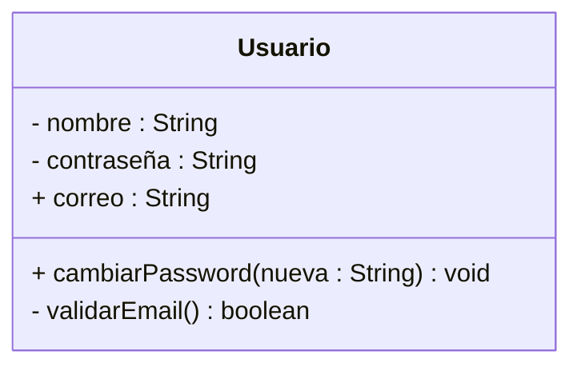
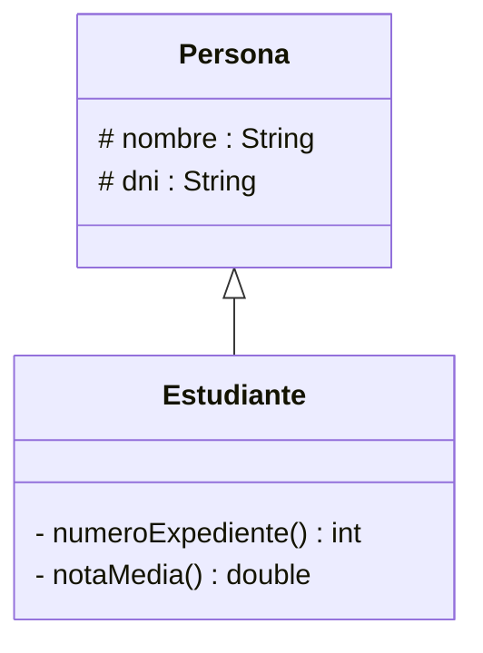
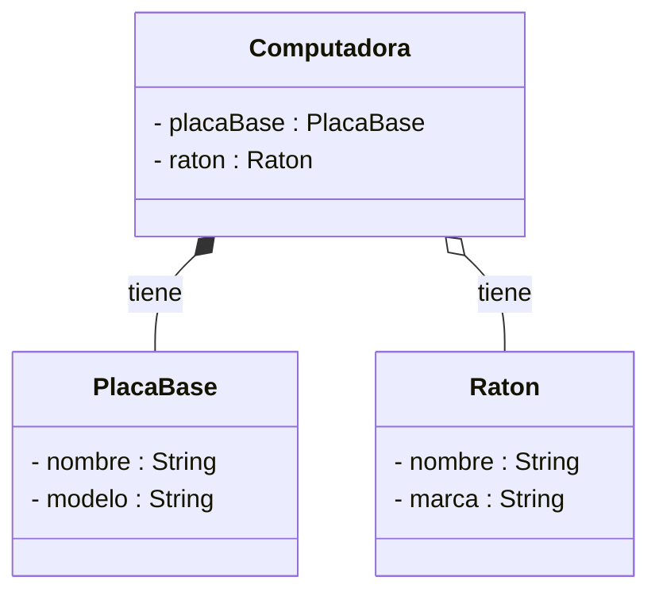
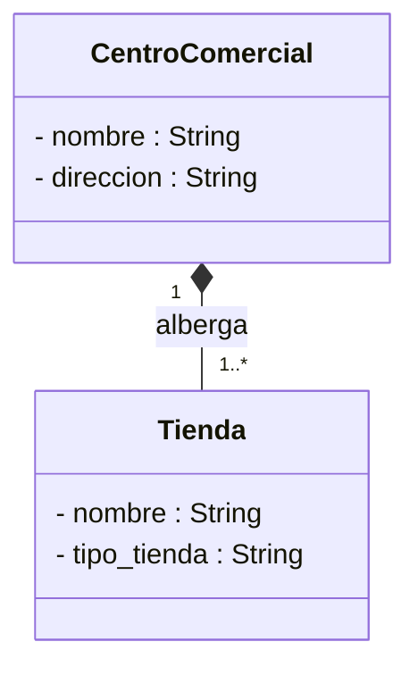
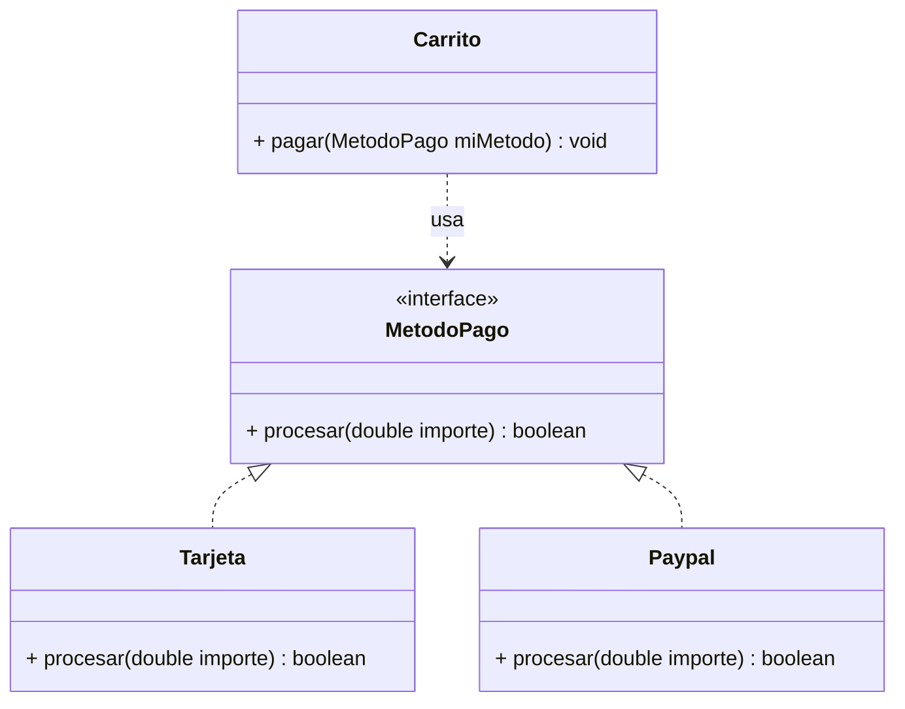
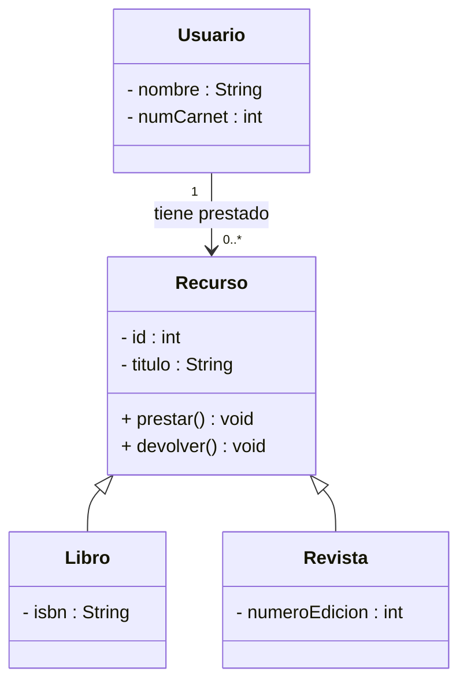

# 6.2.BATERIA DE EJERCICIOS

## Ejercicio 1:

**Supuesto:** Diseña una clase para gestionar un **Usuario** de una plataforma de streaming.

  - **Atributos:** nombre de usuario (privado), contraseña (privada), correo (público).
  - **Métodos:** cambiarPassword(String nueva) (público) y validarEmail() (privado).

## Ejercicio 2:

**Supuesto:** En un sistema escolar, tenemos **Personas** y **Estudiantes**.

  - Una Persona tiene nombre y DNI.
  - Un Estudiante es una Persona, pero además tiene un numeroExpediente y una notaMedia.

## Ejercicio 3:

**Supuesto:** Modelar una **Computadora**.

  - Una Computadora tiene una **PlacaBase**. Si la computadora se destruye, la placa base también se considera destruida (vínculo fuerte).
  - Una Computadora tiene periféricos como un **Raton**. Si la computadora desaparece, el ratón puede usarse en otra (vínculo débil).

## Ejercicio 4:

**Supuesto:** Un **CentroComercial** y sus **Tiendas**.

  - Un CentroComercial puede albergar de 1 a muchas tiendas.
  - Cada Tienda pertenece exactamente a un CentroComercial.

## Ejercicio 5:

**Supuesto:** Sistema de pagos.

  - Crea una interfaz **MetodoPago** con el método procesar(double importe).
  - Las clases **Tarjeta** y **Paypal** deben implementar dicho contrato.
  - La clase **Carrito** tiene un método pagar(MetodoPago miMetodo) (Uso puntual).

    
## Ejercicio 6:

**Supuesto:** Sistema de Gestión de una Biblioteca Universitaria

**Contexto:** La biblioteca necesita un sistema básico para gestionar su catálogo de recursos y los préstamos a los usuarios.

**Requisitos del diseño (UML):**

  - **Clase Recurso (Padre):**
    - **Atributos:** id (int) y titulo (String), ambos privados.
    - **Métodos:** prestar() y devolver(), ambos públicos.
  - **Clases Libro y Revista (Hijas):**
    - Ambas son tipos de Recurso (herencia).
    - Libro tiene un atributo propio: isbn (String).
    - Revista tiene un atributo propio: numeroEdicion (int).
  - **Clase Usuario:**
    - **Atributos:** nombre (String) y numCarnet (int).
    - **Relación:** Un Usuario puede tener **uno o varios** Recurso prestados en un momento dado (1 a 0..*).

