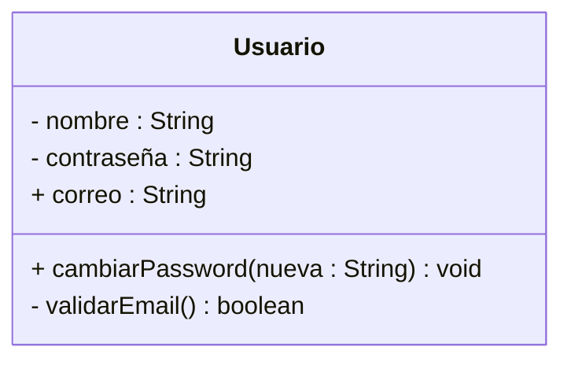
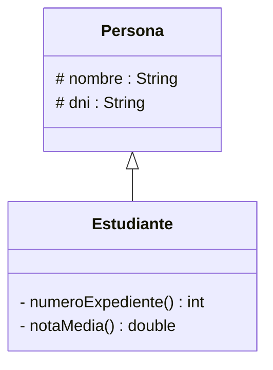
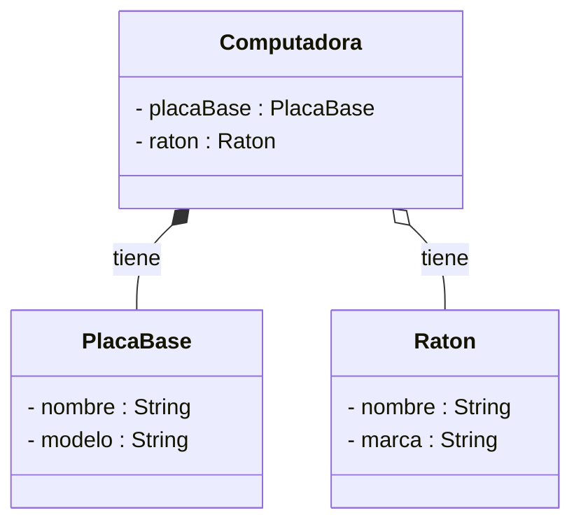
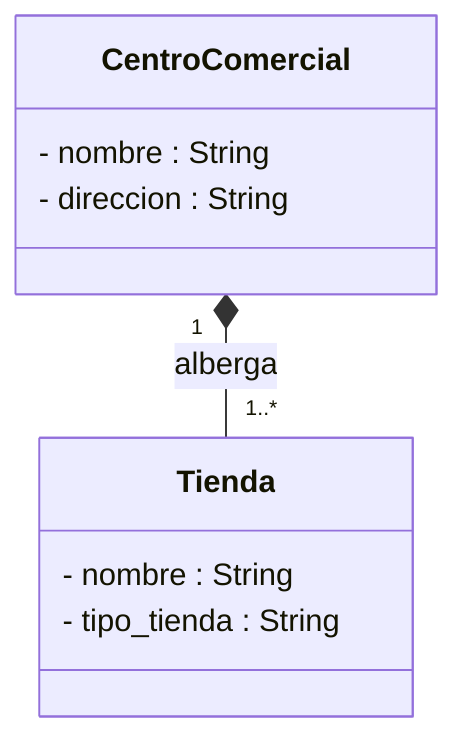
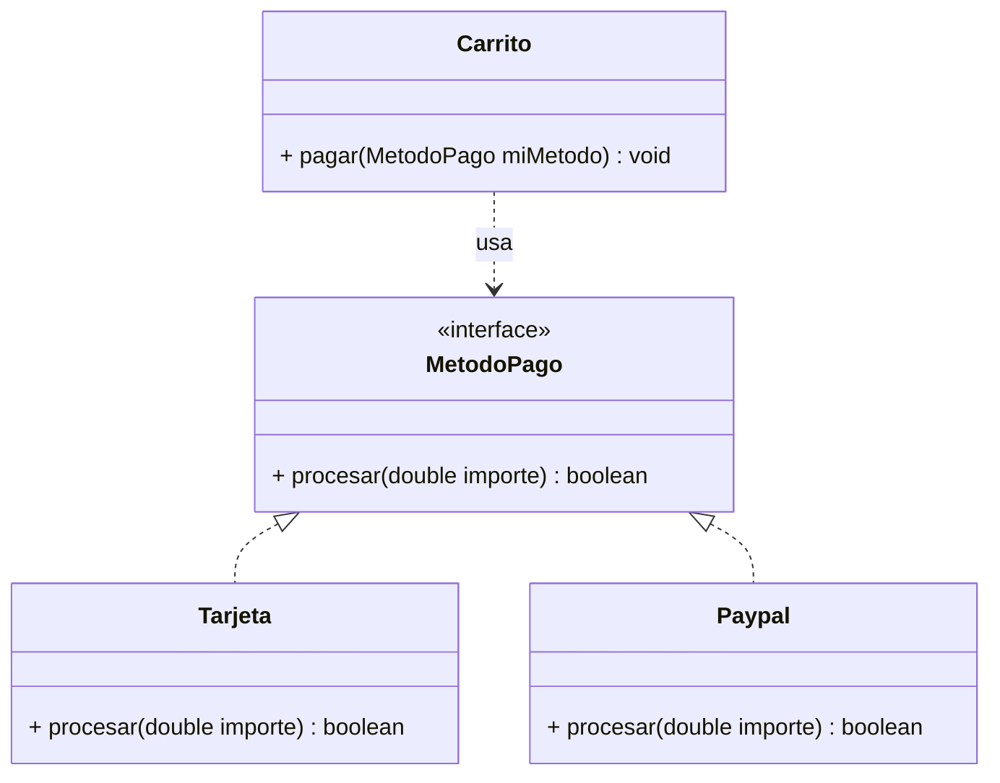

# 6.2.BATERIA DE EJERCICIOS

## Ejercicio 1:

```mermaid
classDiagram
direction TB
    class Usuario {
        - nombre : String
        - contraseña : String
        + correo : String
        + cambiarPassword(nueva : String) void
        - validarEmail() boolean
    }
```

## Ejercicio 2:

```mermaid
classDiagram
direction BT

    class Persona {
        # nombre : String
        # dni : String
    }

    class Estudiante {
        - numeroExpediente() int
        - notaMedia() double
    }

Estudiante --|> Persona
```

## Ejercicio 3:

```mermaid
classDiagram
direction TB

    class Computadora {
        - placaBase : PlacaBase
        - raton : Raton
    }

    class PlacaBase {
        - nombre : String
        - modelo : String
    }

    class Raton {
        - nombre : String
        - marca : String
    }

Computadora *-- PlacaBase : tiene
Computadora o-- Raton : tiene
```

## Ejercicio 4:

```mermaid
classDiagram
direction TB

    class CentroComercial {
        - nombre : String
        - direccion : String
    }

    class Tienda {
        - nombre : String
        - tipo_tienda : String
    }

CentroComercial "1" *-- "1..*" Tienda : alberga
```

## Ejercicio 5:

```mermaid
classDiagram
direction TB

    class MetodoPago {
        <<interface>>
        + procesar(double importe) boolean
    }

    class Tarjeta {
        + procesar(double importe) boolean
    }

    class Paypal {
        + procesar(double importe) boolean
    }

    class Carrito {
        + pagar(MetodoPago miMetodo) void
    }

MetodoPago <|.. Tarjeta
MetodoPago <|.. Paypal
Carrito ..> MetodoPago : usa
```
    
