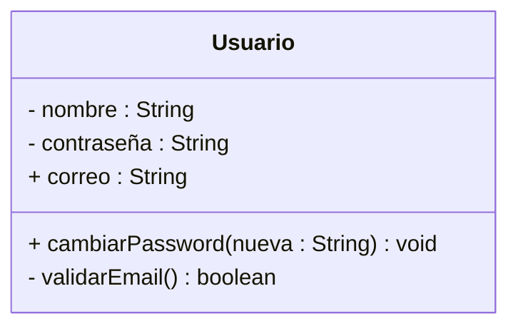
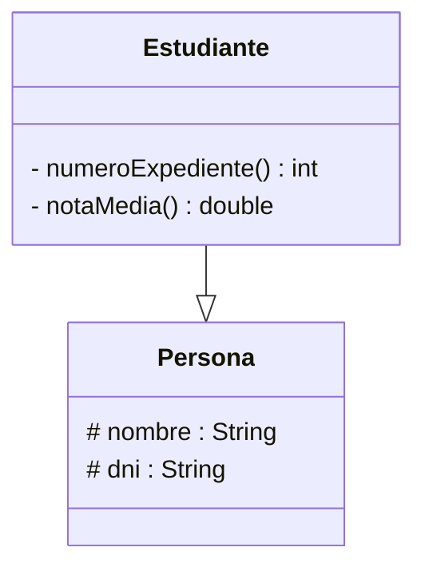

# 6.2.BATERIA DE EJERCICIOS

## Ejercicio 1:

```mermaid
classDiagram
direction TB
    class Usuario {
        - nombre : String
        - contraseña : String
        + correo : String
        + cambiarPassword(nueva : String) void
        - validarEmail() boolean
    }
```

## Ejercicio 2:

```mermaid
classDiagram
direction TB

class Persona {
    # nombre : String
    # dni : String
}

class Estudiante {
    - numeroExpediente() int
    - notaMedia() double
}

Estudiante --|> Persona
```
