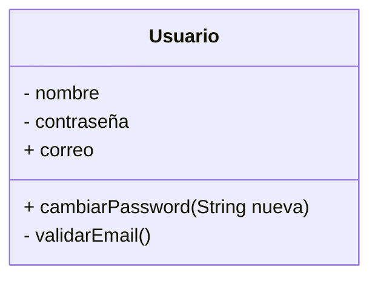

# 6.2.BATERIA DE EJERCICIOS

## Ejercicio 1:

```mermaid
classDiagram
direction TB
    class Usuario {
        - nombre
        - contraseña
        + correo
        + cambiarPassword(String nueva)
        - validarEmail()
    }
```
